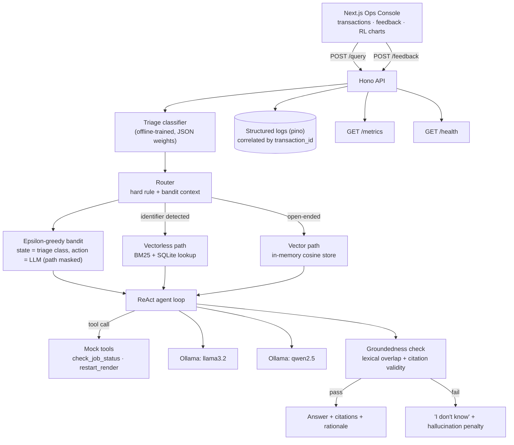

# MediaOps Copilot — Full-Stack Blueprint

A complete implementation plan for a thin-but-real slice across API, retrieval, agentic reasoning, RL routing, hallucination control, classical ML triage, an Ops console, CI/CD, tests, and observability — built on **React/Next.js** (frontend) and **Hono on Node** (backend).

Window: 72 hours. Priority: a thin, working slice across all 11 requirements beats a deep, polished slice of one.

---

## Table of contents

1. [Thin slice first](#1-thin-slice-first)
2. [System architecture](#2-system-architecture)
3. [Stack decisions](#3-stack-decisions)
4. [Repo layout](#4-repo-layout)
5. [API design](#5-api-design)
6. [Vector vs. vectorless — the routing rule](#6-vector-vs-vectorless--the-routing-rule)
7. [Agentic ReAct loop](#7-agentic-react-loop)
8. [RL routing — epsilon-greedy contextual bandit](#8-rl-routing--epsilon-greedy-contextual-bandit)
9. [Hallucination control](#9-hallucination-control)
10. [Classical ML — triage classifier](#10-classical-ml--triage-classifier)
11. [Explainability](#11-explainability)
12. [Ops console (Next.js)](#12-ops-console-nextjs)
13. [CI/CD](#13-cicd)
14. [Test strategy](#14-test-strategy)
15. [SRE & observability](#15-sre--observability)
16. [72-hour roadmap](#16-72-hour-roadmap)
17. [What to learn before/while building](#17-what-to-learn-beforewhile-building)
18. [Final README — required sections](#18-final-readme--required-sections)
19. [Risks & what to cut first](#19-risks--what-to-cut-first)

---

## 1. Thin slice first

The brief says it outright: a thin, working slice across all eleven requirements beats a polished slice of one. Every section below is written so you can implement the smallest correct version first, then thicken it. Treat the callouts marked **MVP cut** as your default path; only go past them if time remains on day 3.

> **The one rule that keeps this project from sprawling:** every requirement produces one artifact that the grader can point at: a route, a table, a test, a log line, a chart. Before adding polish anywhere, make sure all eleven artifacts exist in their smallest form. Polish is a day-3 activity, not a day-1 one.

---

## 2. System architecture

One Hono API process owns retrieval, the agent loop, the bandit, the classifier, and observability. Next.js talks to it over HTTP only. Ollama runs as a sidecar (local process or Docker service) serving two model tags. No external services required — everything runs on a laptop.



Read top to bottom as the request path, and note the two feedback loops that make this "self-optimizing": the **bandit update loop** (triggered by `POST /feedback`) and the **groundedness loop** (triggered inside every `/query` call, before the answer ever reaches the user).

---

## 3. Stack decisions

Given React + Hono/Node as fixed points, here is the concrete pick for every other slot, and why — including where the suggested stack (FastAPI/scikit-learn) gets adapted for a Node runtime.

| Layer | Choice | Why |
|---|---|---|
| API | `hono` + `@hono/node-server`, TypeScript, `zod` for schemas | Matches your production background; zod gives request/response validation and doubles as the OpenAPI-ish contract. |
| Frontend | Next.js 14+ App Router, Tailwind, SWR | Required by the brief. SWR's polling + revalidation is the least code for "recent transactions" and optimistic feedback updates. |
| Vector store | In-memory array of `{id, text, vector}` + cosine similarity; embeddings from Ollama `nomic-embed-text` | 5–6 docs → ~30–50 chunks. A real vector DB is overkill and adds an infra dependency for no benefit at this scale. Swappable for Chroma's JS client later without touching the router. |
| Vectorless store | `better-sqlite3` table for job status + error-code glossary, plus a tiny BM25 (`okapibm25` or hand-rolled TF·IDF) over the same structured records | Two structured lookups covers "exact field match" (job status by ID) and "keyword/BM25" (error-code search) from the requirement in one store. |
| LLMs | Ollama serving `llama3.2:3b` and `qwen2.5:3b` (or `:7b` if hardware allows) | Free, local, two genuinely distinct model families — satisfies "at least two open-source models" without API keys or rate limits. |
| Classical ML | **Hybrid:** offline Python + scikit-learn training script → exports `model.json` (coefficients + feature means/std) → Node does inference as a dot product + softmax at request time | Keeps the runtime pure Node/Hono (no Python service to keep alive) while still using real scikit-learn for training, metrics, and the confusion matrix the brief asks for. Pure-JS fallback in [§10](#10-classical-ml--triage-classifier) if you'd rather avoid Python entirely. |
| RL | Hand-rolled epsilon-greedy contextual bandit, in-memory + persisted to SQLite | No library needed; the brief explicitly wants this simple. SQLite persistence means the "learning" survives a server restart, which matters for a demo. |
| Logging | `pino`, one JSON line per event, `transaction_id` on every line | Node's structlog-equivalent; near-zero overhead, trivial to grep or ship to a log pipeline. |
| Metrics | `prom-client`, Prometheus text format at `/metrics` | Standard, and free interpretation by any Grafana/Prometheus setup without custom parsing. |
| Testing | `vitest` + Hono's built-in test client for API/unit; `@testing-library/react` for one frontend component test; Playwright optional stretch | Vitest shares config/tooling with a Vite-based Next setup and is fast; RTL is the lowest-ceremony way to hit "one basic frontend test." |
| CI/CD | GitHub Actions, npm workspaces monorepo, Docker multi-stage builds | One workflow file, matches the monorepo layout below, satisfies the lint→test→build→(gated)deploy pipeline directly. |

---

## 4. Repo layout

An npm-workspaces monorepo. One `package.json` at the root wires `apps/api` and `apps/web` together so CI can install/lint/test/build both with one set of commands.

```
mediaops-copilot/
├─ apps/
│  ├─ api/                    # Hono + Node + TS
│  │  ├─ src/
│  │  │  ├─ routes/           # query.ts, feedback.ts, health.ts, metrics.ts, transactions.ts
│  │  │  ├─ retrieval/        # vector.ts, vectorless.ts, chunker.ts
│  │  │  ├─ agent/            # react-loop.ts, tools.ts, prompts.ts
│  │  │  ├─ rl/               # bandit.ts, reward.ts, state.ts
│  │  │  ├─ grounding/        # overlap.ts, citations.ts
│  │  │  ├─ classifier/       # infer.ts, model.json (generated)
│  │  │  ├─ data/             # db.ts, seed.ts, mock-docs/*.md, error-codes.json, jobs.json
│  │  │  ├─ observability/    # logger.ts, metrics.ts
│  │  │  └─ app.ts
│  │  ├─ test/                # bandit.test.ts, retrieval.test.ts, api.test.ts, grounding.test.ts
│  │  ├─ Dockerfile
│  │  └─ package.json
│  └─ web/                    # Next.js App Router
│     ├─ app/                 # page.tsx (console), layout.tsx
│     ├─ components/          # TransactionTable, FeedbackButtons, RationalePanel, RLChart, StatusPill
│     ├─ lib/                 # api-client.ts
│     ├─ tests/                # feedback-button.test.tsx
│     ├─ Dockerfile
│     └─ package.json
├─ ml/                        # offline classifier training — Python + scikit-learn
│  ├─ train_triage_classifier.py
│  ├─ synthetic_dataset.csv   # generated, committed for reproducibility
│  └─ metrics_report.md       # accuracy/F1/confusion matrix, generated
├─ .github/workflows/ci.yml
├─ docker-compose.yml         # api + web + ollama
├─ package.json                # npm workspaces root
└─ README.md
```

---

## 5. API design

Five routes total. `/query` and `/feedback` are the graded core; `/transactions` exists purely so the frontend has something to poll (not explicitly required, but the console can't function without it).

| Route | Purpose |
|---|---|
| `POST /query` | Runs the full pipeline: classify → route → retrieve → agent loop → ground → respond. |
| `POST /feedback` | Accepts `{transaction_id, score}`, computes final reward, updates the bandit. |
| `GET /transactions` | Last N transactions with path/LLM/latency/groundedness — feeds the console table. |
| `GET /health` | Pings Ollama and checks the SQLite/vector store are loaded; 200 or 503. |
| `GET /metrics` | Prometheus text: request counts, latency histogram, per-arm reward, hallucination rate. |

**POST /query — request / response**

```jsonc
// Request
{ "query": "why is job #482 stuck", "user_id": "op-142" }

// Response
{
  "transaction_id": "txn_9f2a...",
  "answer": "Job #482 is in state RETRY_WAIT because worker pool 'gpu-a' hit its concurrency limit (3/3 busy). It will resume automatically within 2 minutes; no action needed.",
  "retrieval_path": "vectorless",
  "citations": [
    { "type": "field", "source": "jobs.status", "value": "RETRY_WAIT", "job_id": 482 },
    { "type": "field", "source": "jobs.worker_pool", "value": "gpu-a" }
  ],
  "llm_used": "qwen2.5:3b",
  "latency_ms": 812,
  "groundedness": { "score": 0.78, "band": "High", "flag_ungrounded": false },
  "rationale": {
    "path_reason": "Query contains an explicit job identifier (#482) — routed to the structured job-status table, no semantic search needed.",
    "router_reason": "Bandit chose qwen2.5:3b (exploit): highest running reward (7.4 avg over 11 trials) for triage class 'lookup'.",
    "classifier": { "predicted_class": "lookup", "top_features": [["has_job_id_pattern", 0.91], ["word_count<8", 0.34]] }
  },
  "triage_class": "lookup"
}
```

**POST /feedback — request / response**

```jsonc
// Request
{ "transaction_id": "txn_9f2a...", "score": 1 }

// Response
{ "transaction_id": "txn_9f2a...", "reward": 6.19, "bandit_updated": true, "new_arm_avg": 7.6 }
```

> **MVP cut:** skip streaming responses. A single synchronous JSON response per `/query` call is enough to satisfy every requirement and removes an entire class of frontend complexity (SSE/websocket state).

---

## 6. Vector vs. vectorless — the routing rule

The router runs **before** any LLM call, as a cheap deterministic pass, then the bandit only gets to choose within whatever the rule allows (see [§8](#8-rl-routing--epsilon-greedy-contextual-bandit) for the masking detail). This is the actual design decision the grader is checking your judgment on — write it in the README exactly as stated here.

> **The rule:** if the query contains an **exact structured identifier** — a job ID matching `#\d+`, or a token matching the error-code glossary's naming pattern (`[A-Z]+_[A-Z]+`, e.g. `RENDER_TIMEOUT`) — route **vectorless**: the answer is a deterministic field or dictionary lookup, and semantic search can only add noise or a wrong nearest-neighbor. Otherwise, route **vector**: the query is asking about a concept, symptom, or procedure that's explained in prose across the runbooks, and no exact key exists to look up.

**Vectorless wins** — *"What does error code RENDER_TIMEOUT mean?"*
Exact dictionary hit on `error_codes["RENDER_TIMEOUT"]`. Zero ambiguity, ~5ms, 100% grounded by construction. A vector search here could easily surface a semantically-similar-but-wrong entry (e.g. `QUEUE_TIMEOUT`) as a top-3 neighbor.

**Vector wins** — *"Why is my render slower than usual?"*
No exact key exists for "slower than usual." The answer is scattered across the worker-concurrency runbook and the architecture FAQ (queue depth, storage delivery backpressure). Semantic similarity over chunked runbooks retrieves the top-3 relevant passages; a keyword lookup would need the user to already know the right vocabulary.

**Implementation notes**

- Mock docs (5–6, markdown): stuck-job runbook, slow-render runbook, storage-delivery-failure runbook, worker-concurrency FAQ, architecture FAQ, plus the error-code glossary and job-status table as *structured* data (JSON/SQLite, not chunked).
- Vector path: chunk runbooks by heading (~150–300 tokens/chunk), embed with Ollama's `nomic-embed-text`, cosine-rank, take top-3, pass chunk text + chunk IDs to the agent as citable evidence.
- Vectorless path: regex-extract the identifier, do a direct dict/SQL lookup; if a BM25 layer is added on top of the glossary (for fuzzier error-code phrasing), keep it separate from the vector index so the two paths stay architecturally distinct, as required.
- Confidence fallback: if the vector path's top similarity score is below a threshold (e.g. 0.55 cosine), that's itself a signal to escalate to "I don't know" rather than force an answer — feeds [§9](#9-hallucination-control).

---

## 7. Agentic ReAct loop

A small explicit state machine, not a framework. Cap at 3 iterations to bound latency and keep the reward function's latency term meaningful.

1. **Thought** — the LLM is prompted with the query, retrieved evidence (from whichever path the router picked), and a list of available tools, and must emit one JSON object: `{thought, action: "answer"|"call_tool", tool?, tool_input?, answer?, citations?}`.
2. **Action** — if `call_tool`, execute the mock tool (`check_job_status(job_id)`, `restart_render(job_id)` — non-destructive, returns canned/deterministic JSON from the same job table) and append the result as an `Observation` to the prompt.
3. **Repeat** — loop back to Thought with the growing transcript, max 3 rounds, then force an answer (or escalate) if the model hasn't converged.
4. **Answer** — once `action: "answer"`, the loop exits and the answer + citations pass to the groundedness check before ever reaching the user.

> **Getting structured output out of small local models reliably:** use Ollama's `format: "json"` mode plus a strict system prompt with one worked example. Wrap the parse in try/catch with one retry (re-prompt with "your last response wasn't valid JSON, try again"); if it still fails, treat as ungrounded and escalate. Don't build a fragile hand-rolled parser — this single retry covers the vast majority of small-model formatting slips.

---

## 8. RL routing — epsilon-greedy contextual bandit

**State:** the triage classifier's predicted class (`lookup` / `howto` / `incident_urgent`) — 3 discrete states, straight from [§10](#10-classical-ml--triage-classifier).

**Action:** which LLM to use (`llama3.2` / `qwen2.5`) — 2 arms per state. The retrieval *path* is decided by the deterministic router rule first and passed in as a mask/context, not re-learned by the bandit.

This reads as choosing only the LLM, but it satisfies the requirement's "path and/or LLM" wording deliberately: re-learning the path from scratch would waste exploration budget re-discovering a rule that's already deterministic and 100% reliable (an exact job ID *always* wants the structured lookup). The interesting, genuinely uncertain decision — which model answers better/faster/less-hallucinated per query type — is what the bandit actually explores. State this trade-off explicitly in the README; it's a judgment call the grader is evaluating.

**Reward**

```
reward = feedback_score * 10 - latency_seconds - hallucination_penalty
// feedback_score ∈ {0, 1}, from POST /feedback
// hallucination_penalty = 5 if groundedness check failed, else 0
```

**Update rule (incremental sample average)**

```
Q[state][arm] = Q[state][arm] + alpha * (reward - Q[state][arm])
N[state][arm] += 1
// alpha = 1 / N[state][arm]   (true running average)
// or a fixed alpha (e.g. 0.2) if you want recent feedback to matter more
```

**Selection (epsilon-greedy, epsilon ≈ 0.15)**

```
if random() < epsilon:
    arm = random_choice(available_arms)   // explore
else:
    arm = argmax(Q[state][a] for a in available_arms)  // exploit
```

> **Why the update happens on `/feedback`, not on `/query`:** the true reward needs the human feedback term, which doesn't exist yet at query time. So `/query` selects an arm and records latency + groundedness against the transaction, but the actual `Q`-table update fires exactly once, inside `/feedback`, when the full reward can finally be computed. A transaction that never receives feedback simply never updates the bandit — that's correct behavior, not a bug, and worth a one-line comment in the code.

**Persistence & explore/exploit transparency**

- Persist `Q[state][arm]` and `N[state][arm]` to a small SQLite table so the router keeps its learning across restarts — this is what makes the frontend's "reward trend" chart meaningful over a multi-session demo.
- Every `/query` response's `rationale.router_reason` states plainly whether this pick was an explore or exploit move, and what the current running average is for the chosen arm — this is what Requirement 7 (explainability) needs verbatim.

---

## 9. Hallucination control

Two cheap, concrete, unit-testable checks — no external NLI model needed at this scale.

| Check | How | Failure behavior |
|---|---|---|
| Citation validity | Every citation the LLM emits must reference a chunk ID or field name that was actually in the evidence passed to it. String-match against the retrieved set. | Any invalid citation → automatic ungrounded, no partial credit. |
| Lexical overlap / groundedness score | Jaccard (or TF·IDF cosine) similarity between the answer's sentences and the text of the cited evidence. | Score < 0.35 → ungrounded. 0.35–0.6 → Medium confidence. ≥ 0.6 → High confidence. |

When either check fails, the API **overrides** the model's answer with a fixed escalation response ("I don't have enough grounded evidence to answer confidently — recommend a human check job #482 directly") rather than returning the model's ungrounded text. `hallucination_penalty = 5` is applied in the reward the moment feedback lands, whether or not the human happened to click thumbs-up on the escalation message.

> **MVP cut:** skip a full NLI entailment model. Lexical overlap plus citation validity is concrete, explainable in one sentence to an operator, deterministic (easy to unit test), and defensible as "a simple lexical-overlap score" — exactly what the brief accepts.

---

## 10. Classical ML — triage classifier

Predicts `triage_class ∈ {lookup, howto, incident_urgent}` from cheap query-level features. Its output becomes both the RL state and the router's secondary signal.

| Feature | Type | Signal |
|---|---|---|
| `char_length`, `word_count` | numeric | Very short queries with an ID tend to be lookups; long descriptive queries tend to be howto/incident. |
| `has_job_id_pattern` | boolean | `#\d+` present. |
| `has_error_code_pattern` | boolean | `[A-Z]+_[A-Z]+` present. |
| `urgency_keyword_flag` | boolean | Contains "production down", "urgent", "P1", "failed", "stuck". |
| `howto_keyword_flag` | boolean | Contains "how do i", "why", "explain", "what does". |
| `past_similar_incidents` | numeric (synthetic) | Mock historical-incident count for the closest keyword match — stands in for "historical incident metadata." |

**Model & pipeline**

- Generate ~200–300 synthetic labeled rows from templated query patterns (e.g. programmatically fill "why is job #{n} {symptom}" for `incident_urgent`, "what does {code} mean" for `lookup`, "how do i {action}" for `howto`), with light noise so it isn't trivially separable.
- Train **multinomial logistic regression** in `ml/train_triage_classifier.py` with scikit-learn (80/20 split, standardized features). Logistic regression is the right pick over Random Forest/GBM here specifically because its coefficients are what Requirement 7 needs for explainability — a forest's `feature_importances_` is global and can't say "this query, this feature, this direction" per prediction the way a coefficient × standardized-value contribution can.
- Export `{coefficients, intercepts, feature_mean, feature_std, classes}` as `model.json`. Node's `classifier/infer.ts` re-implements only standardize → dot product → softmax (~15 lines) — no ML runtime needed in the API process.
- Report accuracy, macro-F1, and the confusion matrix in `ml/metrics_report.md`, generated by the training script, with 2–3 sentences of interpretation (e.g. which class the model confuses most, and a plausible reason — likely `howto` vs `incident_urgent` when a query has both a "why" and an urgent keyword).

> **Pure-JS fallback, if you want zero Python:** swap in `ml-logistic-regression` or a hand-rolled gradient-descent logistic regression directly in TypeScript, trained once at build time from the same synthetic CSV, weights saved to the same `model.json` shape. Compute accuracy/F1/confusion matrix with a ~20-line script instead of scikit-learn. Functionally equivalent; the hybrid approach above is recommended only because scikit-learn's `classification_report` is one line versus writing your own.

---

## 11. Explainability

Everything below is already present in the `rationale` object shown in [§5](#5-api-design) — this section is about what to render, not new computation.

| Surfaced to the operator | Kept as an internal detail |
|---|---|
| Which path was used and the one-sentence rule that triggered it | The exact regex patterns and threshold constants |
| Which LLM answered, and whether that was explore or exploit, with the arm's running reward | The full `Q`-table and update history for every state |
| A High/Medium/Low confidence band | The raw Jaccard/cosine float and citation-matching internals |
| Top 1–2 classifier features that drove the triage label, in plain language | Full coefficient vector and standardization constants |

For the README: an operator needs enough to *sanity-check a decision*, not enough to *audit the model*. A float like `0.71` next to "groundedness" builds no trust for a support engineer mid-incident; "High confidence — 71% of the answer overlaps with the cited job record" does. Full mechanistic interpretability of the LLM itself is explicitly out of scope per the brief — what's in scope is the routing and retrieval decision trail around it, which is fully deterministic and fully explainable by construction.

---

## 12. Ops console (Next.js)

| Component | Responsibility |
|---|---|
| `app/page.tsx` | Server-rendered shell; renders the query box, `TransactionTable`, and `RLChart`. |
| `QueryBox` | Text input → `POST /query`, appends the new transaction to local SWR cache optimistically. |
| `TransactionTable` | SWR-polled (`GET /transactions`, 5s interval). Columns: query, vector/vectorless pill, LLM, latency, High/Medium/Low groundedness pill, feedback buttons. |
| `FeedbackButtons` | 👍/👎 → `POST /feedback`; disables + shows the resulting reward inline on success, real state change, no dead buttons. |
| `RationalePanel` | Expandable row detail rendering the `rationale` object as prose, not raw JSON. |
| `RLChart` | Two small charts (Recharts): bar of arm-selection counts per state, line of reward trend over recent transactions. |

> **MVP cut:** one page. No auth, no routing between views — a detail drawer/expandable row beats a separate transaction-detail route for the time this saves.

---

## 13. CI/CD

```yaml
name: ci
on: [pull_request, push]
jobs:
  test:
    runs-on: ubuntu-latest
    steps:
      - uses: actions/checkout@v4
      - uses: actions/setup-node@v4
        with: { node-version: 20, cache: npm }
      - run: npm ci
      - run: npm run lint --workspaces --if-present
      - run: npm test --workspaces --if-present
      - run: npm run build --workspaces --if-present

  docker:
    needs: test
    runs-on: ubuntu-latest
    steps:
      - uses: actions/checkout@v4
      - run: docker build -t mediaops-api ./apps/api
      - run: docker build -t mediaops-web ./apps/web

  deploy:
    needs: [test, docker]
    if: github.ref == 'refs/heads/main'
    runs-on: ubuntu-latest
    steps:
      - run: echo "deploying mediaops-api + mediaops-web (mock push to registry)"
```

Three jobs, dependency-chained via `needs`, with `deploy` additionally gated on branch. This is the whole requirement — no infra behind the `echo` is needed.

---

## 14. Test strategy

| Layer | Tool | Covers |
|---|---|---|
| RL bandit | vitest | Q-update arithmetic (known reward → expected new Q), epsilon=0 always exploits the argmax arm, epsilon=1 always explores, state isolation (updating one state's arm doesn't touch another's). |
| Vector retrieval | vitest | A known query returns the expected chunk in its top-3 by cosine similarity. |
| Vectorless retrieval | vitest | A known error code / job ID returns the exact expected field(s). |
| API | vitest + Hono test client | `/query` happy path; `/feedback` updates the bandit; failure mode — Ollama mocked unreachable → API falls back to a degraded vectorless-only response instead of 500ing. |
| Frontend | @testing-library/react | Clicking 👍 calls `POST /feedback` and flips the button to a "recorded" state. |

The brief flags the RL tests as "the layer most candidates skip, and the one we look at closest" — write those first, not last.

---

## 15. SRE & observability

**Structured logging**

```json
{"level":"info","transaction_id":"txn_9f2a","event":"route_selected","path":"vectorless","ts":"..."}
{"level":"info","transaction_id":"txn_9f2a","event":"llm_selected","arm":"qwen2.5:3b","mode":"exploit","ts":"..."}
{"level":"warn","transaction_id":"txn_9f2a","event":"groundedness_check","score":0.22,"flag_ungrounded":true,"ts":"..."}
{"level":"info","transaction_id":"txn_9f2a","event":"bandit_update","state":"lookup","arm":"qwen2.5:3b","reward":6.19,"ts":"..."}
```

**Health, metrics, degradation**

| Dependency down | /health reflects | Runtime fallback |
|---|---|---|
| Ollama unreachable | `503`, `{"ollama":"down"}` | `/query` returns a clearly-labeled degraded response using only the vectorless path's raw field data, no LLM synthesis — never a hard crash. |
| Vector store not loaded | `503`, `{"vector_store":"down"}` | Router forces vectorless for every query until the store reloads. |

`/metrics` (Prometheus text): `http_requests_total`, `request_latency_seconds` (histogram), `retrieval_path_total{path}`, `llm_arm_avg_reward{arm,state}`, `hallucination_flag_total`, `ollama_up`, `vector_store_up`.

**If this broke at 3am**

1. **Check `/health` first.** A 503 tells you immediately whether it's Ollama or the vector store, before you touch a single log line.
2. **Grep logs by `transaction_id`** from the user's report to see the exact route/arm/groundedness decision chain for that one request.
3. **Check `hallucination_flag_total` rate on `/metrics`.** A spike means the router is favoring the wrong path or a model is drifting into ungrounded answers — cross-check against `retrieval_path_total` to see if it correlates with one path.
4. **Check `llm_arm_avg_reward` per state.** If one arm's average craters, feedback is telling you that model/path combo is failing in production — the bandit will self-correct, but a sudden cliff is worth a manual look at recent transcripts.

---

## 16. 72-hour roadmap

Three work sessions, each aimed at making every requirement exist in its smallest form before any one layer gets deep.

**Day 1 — skeleton + data**
- Monorepo scaffold, Hono app boots, Next.js app boots
- Mock docs + error-code glossary + job-status table (SQLite)
- Vector path: chunk, embed, cosine search
- Vectorless path: regex + dict/SQL lookup
- Router hard rule wired, unit-tested
- `/query` returns a real (non-agentic) answer end to end

**Day 2 — reasoning + learning**
- ReAct loop + 2 mock tools + Ollama wiring (both models)
- Groundedness check + escalation path
- Bandit: state/action/reward, SQLite persistence
- `/feedback` triggers the real Q-update
- Synthetic dataset + sklearn training script + `model.json`
- Rationale object assembled and returned from `/query`

**Day 3 — surface + harden**
- Ops console: table, feedback buttons, RL chart
- `/health`, `/metrics`, pino logging, degradation paths
- Full test suite (bandit, retrieval ×2, API ×2, one frontend test)
- GitHub Actions workflow green, Dockerfiles build
- README: routing rationale, RL strategy, metrics, SRE note
- Buffer for whatever slipped — do not start new scope here

---

## 17. What to learn before/while building

| Area | Concepts to have solid |
|---|---|
| Hono/Node API | Route/middleware composition, zod validation, streaming vs. sync responses, `@hono/node-server` deployment shape. |
| Retrieval | Embeddings + cosine similarity from first principles, chunking trade-offs, TF·IDF/BM25 scoring, why exact lookup beats semantic search for structured fields. |
| Agentic patterns | ReAct (Thought/Action/Observation), tool-calling as structured JSON, prompting small local models for reliable JSON, Ollama's `/api/generate` & `/api/chat` and `format: "json"`. |
| Reinforcement learning | Multi-armed vs. contextual bandits, epsilon-greedy exploration/exploitation, incremental sample-average updates, reward shaping and why unit-testing reward math matters. |
| Hallucination mitigation | Groundedness/entailment basics, Jaccard/TF·IDF cosine overlap, citation-validity checking as a cheap proxy for entailment. |
| Classical ML | Logistic regression (incl. softmax for multi-class), train/test split, precision/recall/F1, reading a confusion matrix, coefficients as local explanations vs. tree feature_importances_ as global ones. |
| Frontend | Next.js App Router server/client component split, SWR polling + optimistic updates, a charting lib (Recharts) for the reward/arm views. |
| Testing | vitest fundamentals, mocking an unreachable dependency (Ollama down) cleanly, @testing-library/react basics, (optional) Playwright for one e2e flow. |
| CI/CD & Docker | GitHub Actions job dependencies (`needs`) and branch-gated jobs, multi-stage Dockerfiles, npm workspaces in CI. |
| SRE/observability | Correlation IDs in structured logs, liveness vs. readiness semantics for `/health`, Prometheus text exposition format, graceful-degradation/circuit-breaker patterns. |

---

## 18. Final README — required sections

Map directly onto the grading rubric; write these as you build each piece, not retroactively on day 3.

- Setup: prerequisites (Node, Docker, Ollama + which model tags to pull), one-command run via `docker-compose up`, and a bare-metal fallback (`npm install && npm run dev` per workspace).
- Vector-vs-vectorless routing rationale, with the two concrete example queries from [§6](#6-vector-vs-vectorless--the-routing-rule).
- RL strategy: state/action/reward definition, why the LLM-only action space with path-masking (from [§8](#8-rl-routing--epsilon-greedy-contextual-bandit)), and how to observe learning happening (console chart + `/metrics`).
- Hallucination-handling approach: the two checks, the thresholds, and what "I don't know" actually returns.
- Triage-classifier metrics: accuracy/F1, confusion matrix, 2–3 sentences of interpretation.
- What's explained to the user vs. kept internal, and why (from [§11](#11-explainability)).
- Testing approach: what's covered per layer, how to run it (`npm test --workspaces`).
- SRE "if this broke at 3am" note (reuse [§15](#15-sre--observability) verbatim, it's already written for this).

---

## 19. Risks & what to cut first

- Local model latency on modest hardware: if 3B models are too slow for a snappy demo, drop to one model with two distinct system-prompt "personalities" as the two RL arms — still satisfies "two model variants," and keeps latency (and thus the reward function) usable.
- Embedding cost/time: precompute and cache chunk embeddings at server startup (not per-request) — this alone is the difference between a snappy vector path and a sluggish one.
- If Playwright feels like too much setup, one @testing-library/react test on the feedback button fully satisfies the frontend testing requirement — don't add e2e unless everything else is already done.
- If the Python training-script hybrid feels like unwanted complexity given a pure-Node stack, use the pure-JS fallback from [§10](#10-classical-ml--triage-classifier) — same deliverable, one less language in the repo.
- Docker for the frontend is "ideally," not required — if time is short, ship the API Dockerfile only and note the frontend runs via `next build && next start` in CI instead.
