# MediaOps Copilot — High-Level System Design

**Document type:** High-Level Design (HLD)
**System:** MediaOps Copilot — a self-optimizing support agent for a media-generation / render-orchestration platform
**Status:** Design baseline for a 72-hour build
**Related docs:** [`MediaOps-Copilot-Plan.md`](./MediaOps-Copilot-Plan.md) (build plan & sequencing), [`Learning-Guide.md`](./Learning-Guide.md) (concept primers)

---

## Table of contents

1. [Purpose, scope & design goals](#1-purpose-scope--design-goals)
2. [Requirements traceability](#2-requirements-traceability)
3. [Level 1 — System context](#3-level-1--system-context)
4. [Level 2 — Container architecture](#4-level-2--container-architecture)
5. [Level 3 — API component decomposition](#5-level-3--api-component-decomposition)
6. [Request lifecycles](#6-request-lifecycles)
7. [Routing subsystem](#7-routing-subsystem)
8. [Retrieval subsystem](#8-retrieval-subsystem)
9. [Agentic subsystem (ReAct)](#9-agentic-subsystem-react)
10. [Reinforcement-learning subsystem](#10-reinforcement-learning-subsystem)
11. [Groundedness & hallucination control](#11-groundedness--hallucination-control)
12. [Triage classifier subsystem](#12-triage-classifier-subsystem)
13. [Explainability subsystem](#13-explainability-subsystem)
14. [Data model & storage](#14-data-model--storage)
15. [Interface contracts](#15-interface-contracts)
16. [Frontend architecture](#16-frontend-architecture)
17. [Observability architecture](#17-observability-architecture)
18. [Failure modes & graceful degradation](#18-failure-modes--graceful-degradation)
19. [Deployment & CI/CD topology](#19-deployment--cicd-topology)
20. [Test architecture](#20-test-architecture)
21. [Security, privacy & safety](#21-security-privacy--safety)
22. [Performance envelope & scaling path](#22-performance-envelope--scaling-path)
23. [Key design decisions (ADR log)](#23-key-design-decisions-adr-log)
24. [Out of scope & future work](#24-out-of-scope--future-work)

---

## 1. Purpose, scope & design goals

### 1.1 Problem statement

Support engineers operating a render pipeline ask two structurally different kinds of questions:

| Question shape | Example | Correct machinery |
|---|---|---|
| **Exact / structured** — the answer is a *field* in a table | "Why did job #482 fail?", "What does `RENDER_TIMEOUT` mean?" | Deterministic lookup. Embeddings add latency, cost, and a chance of returning a *similar* row instead of the *right* row. |
| **Fuzzy / open-ended** — the answer is *explained* across prose | "Why is my render slower than usual?", "How do I safely retry a stuck job?" | Semantic retrieval over runbook chunks. |

A system that treats both as "RAG" is wrong twice: it is slower and less accurate on the first class, and it has no fallback on the second. The core design thesis of this system is therefore **routing before retrieval**, and **learning the routing policy from production signal** rather than freezing it in code.

### 1.2 Design goals (ranked)

| # | Goal | How the design serves it |
|---|---|---|
| G1 | **Never assert an ungrounded claim** | Every answer carries machine-checkable citations; a groundedness gate sits between generation and response and can force `I don't know`. |
| G2 | **Pick the cheapest correct retrieval path** | Deterministic hard rules handle unambiguous cases; a bandit learns the rest. |
| G3 | **Improve from real signal** | `POST /feedback` writes directly into the bandit; reward folds in measured latency and the grounding verdict. |
| G4 | **Be explainable to an operator, not to an ML researcher** | A rationale object rendered in the console: path + why, arm + why, confidence band, top classifier features. |
| G5 | **Behave like a service, not a notebook** | Health that probes real dependencies, JSON logs correlated by transaction ID, Prometheus metrics, degradation instead of crashes, CI-gated Docker builds. |
| G6 | **Run anywhere, with no API keys** | Local Ollama models, in-process vector store, SQLite. `docker compose up` is the whole setup. |

### 1.3 Non-goals

Multi-tenant auth, real render infrastructure, distributed vector serving, deep-learning RL, calibrated probability estimates, and full LLM interpretability are explicitly out of scope. Where the design would change under those constraints, it is noted in [§22](#22-performance-envelope--scaling-path).

### 1.4 Architectural principles

1. **One process, clear seams.** A single API process hosts retrieval, agent, RL, classifier, and observability — but each is a module behind an interface, so any one can move out of process without a rewrite.
2. **Deterministic before probabilistic.** If a regex, a primary-key lookup, or a dictionary hit answers the question, no model is invoked.
3. **Every decision is recorded, not just its outcome.** The transaction row stores the path, the arm, the epsilon draw, the scores, and the evidence — which is what makes both the RL loop and the explanation panel possible.
4. **Degradation is a designed state, not an exception handler.** Each dependency has a declared fallback and a user-visible `degraded` marker.

---

## 2. Requirements traceability

Each assignment requirement maps to exactly one owning component and one gradeable artifact.

| Req | Requirement | Owning component | Primary artifact |
|---|---|---|---|
| 1 | `POST /query`, `POST /feedback` | `routes/` | Two HTTP routes with zod-validated contracts ([§15](#15-interface-contracts)) |
| 2 | Vector vs. vectorless retrieval | `retrieval/` + `router/` | Two retrievers behind one `Retriever` interface + a documented decision table ([§7](#7-routing-subsystem)) |
| 3 | ReAct loop + ≥2 open models | `agent/` | Thought→Action→Observation transcript; `llama3.2` and `qwen2.5` as selectable arms ([§9](#9-agentic-subsystem-react)) |
| 4 | Online RL | `rl/` | Epsilon-greedy contextual bandit with persisted arm statistics ([§10](#10-reinforcement-learning-subsystem)) |
| 5 | Hallucination handling | `grounding/` | Citation validator + lexical-overlap gate + abstention path ([§11](#11-groundedness--hallucination-control)) |
| 6 | Classical ML triage | `classifier/` | scikit-learn model exported to JSON weights + metrics report ([§12](#12-triage-classifier-subsystem)) |
| 7 | Explainability | `explain/` | `rationale` object on every response, rendered in the console ([§13](#13-explainability-subsystem)) |
| 8 | Next.js ops console | `apps/web` | Transaction table, live feedback control, RL trend view ([§16](#16-frontend-architecture)) |
| 9 | CI/CD | `.github/workflows` | lint → test → build → gated deploy ([§19](#19-deployment--cicd-topology)) |
| 10 | Test automation | `test/` | Bandit unit tests, per-path retrieval tests, API tests incl. dependency-down, one frontend test ([§20](#20-test-architecture)) |
| 11 | SRE & observability | `observability/` | JSON logs keyed by `transaction_id`, dependency-probing `/health`, `/metrics`, degradation matrix ([§17](#17-observability-architecture), [§18](#18-failure-modes--graceful-degradation)) |

---

## 3. Level 1 — System context

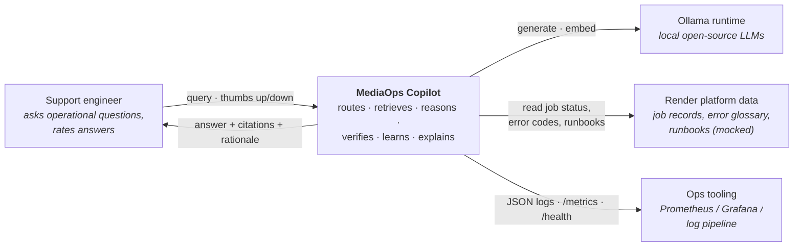

**Trust boundaries.** The engineer is trusted but unauthenticated in this build (single-operator console). The LLM runtime is treated as *untrusted output*: nothing it emits reaches the user without passing citation validation and the grounding gate. The platform data is the only source of truth.

---

## 4. Level 2 — Container architecture

Three runtime containers plus two data stores. Everything is local; nothing requires an account or a key.

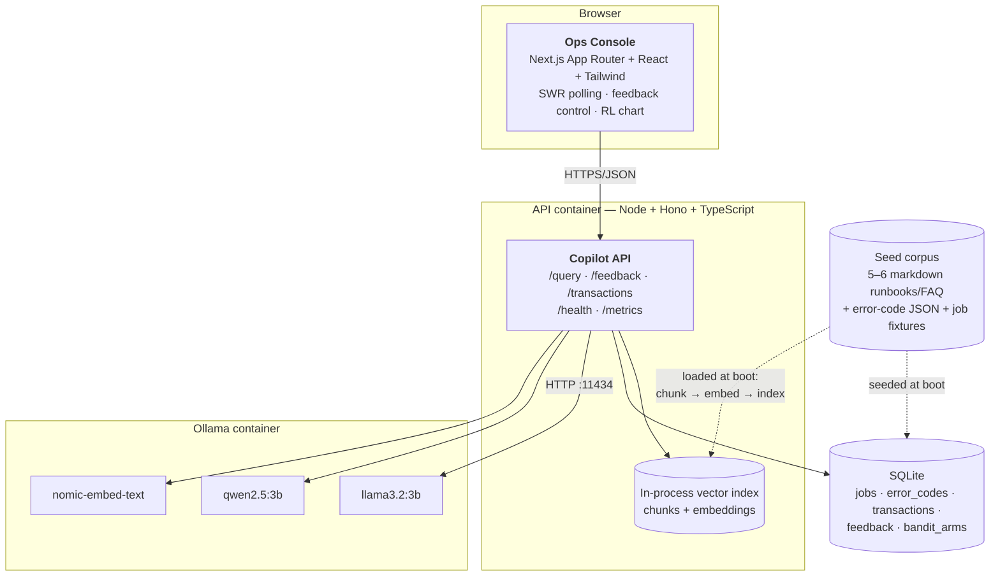

### 4.1 Container responsibilities

| Container | Responsibility | Scales by | State |
|---|---|---|---|
| **Ops Console** (Next.js) | Presentation only. No business logic, no direct store access. Renders transactions, rationale panels, RL trend; posts feedback. | Static/edge; stateless | None (SWR cache) |
| **Copilot API** (Hono) | All decision logic: triage → route → retrieve → reason → verify → explain → learn. Owns every write. | Horizontally, once bandit + vector state externalize ([§22](#22-performance-envelope--scaling-path)) | Vector index in memory (rebuildable); everything durable in SQLite |
| **Ollama** | Generation and embeddings for two model families. Treated as a replaceable, possibly-unavailable dependency. | Vertically / GPU | Model weights only |

### 4.2 Why one API process

At this corpus size (5–6 docs → ~30–50 chunks) a network-attached vector database, a Python ML sidecar, and a separate RL service would each add a failure mode and a deployment step while buying nothing. The design keeps them as **modules with clean interfaces** (`Retriever`, `Policy`, `Classifier`, `Grounder`) so extraction is a config change, not a redesign. The one genuine cross-language need — scikit-learn training — is handled **offline**: Python trains and exports JSON weights, Node performs inference. No Python process exists at runtime.

---

## 5. Level 3 — API component decomposition

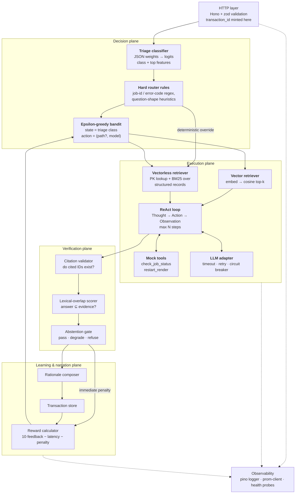

### 5.1 Module contracts

These four interfaces are the seams that keep the monolith decomposable:

```ts
interface Retriever {
  name: 'vector' | 'vectorless';
  retrieve(query: string, ctx: QueryContext): Promise<Evidence[]>;
  health(): Promise<DependencyStatus>;
}

interface Policy {                    // implemented by EpsilonGreedyBandit
  select(state: State, allowed: Action[]): Decision;   // { action, exploring, armStats }
  update(state: State, action: Action, reward: number): void;
  snapshot(): ArmStats[];             // powers /metrics and the console chart
}

interface Grounder {
  score(answer: string, evidence: Evidence[]): GroundingVerdict; // { band, overlap, validCitations, grounded }
}

interface Classifier {
  predict(query: string, meta: QueryMeta): Triage; // { class, confidence, topFeatures[] }
}
```

`Evidence` is the universal currency of the system — both retrievers and every tool emit it, so citation validation, grounding, and the rationale panel are path-agnostic:

```ts
type Evidence = {
  id: string;                 // "runbook-timeouts#c3" | "job:482.failure_reason" | "tool:check_job_status(482)"
  source: 'vector' | 'vectorless' | 'tool';
  text: string;               // the exact text the answer may rely on
  score?: number;             // cosine / BM25 / null for exact hits
  meta: Record<string, unknown>;
};
```

---

## 6. Request lifecycles

### 6.1 `POST /query` — the answer path

```mermaid
sequenceDiagram
  autonumber
  participant U as Console
  participant A as API
  participant C as Classifier
  participant R as Router+Bandit
  participant RET as Retriever
  participant AG as ReAct agent
  participant L as Ollama
  participant G as Grounding gate
  participant D as SQLite

  U->>A: POST /query {query}
  A->>A: mint transaction_id, start timer, bind logger
  A->>C: triage(query)
  C-->>A: {class, topFeatures}
  A->>R: select(state=class)
  R-->>A: {path, model, exploring, armStats}
  Note over R: hard rule may pin path;<br/>bandit still selects the model
  A->>RET: retrieve(query)
  RET-->>A: Evidence[]
  alt evidence empty or below floor
    A-->>U: "I don't know" + escalation, grounded=false
  else evidence found
    A->>AG: reason(query, evidence, tools)
    loop max 3 steps
      AG->>L: prompt (model = chosen arm)
      L-->>AG: Thought / Action / Final
      opt Action = tool
        AG->>AG: run mock tool → append Evidence
      end
    end
    AG-->>A: draft answer + cited evidence ids
    A->>G: validate citations + overlap
    alt grounded
      G-->>A: band High/Medium
    else ungrounded
      G-->>A: refuse → replace answer with "I don't know", penalty = P
    end
  end
  A->>D: persist transaction (path, model, latency, verdict, evidence, rationale)
  A-->>U: 200 {answer, path, model, latency_ms, grounded, transaction_id, citations, rationale}
```

**Latency budget (target, local 3B models):**

| Stage | Vectorless | Vector |
|---|---|---|
| Triage classify | ~1 ms | ~1 ms |
| Retrieve | 2–10 ms (SQLite/BM25) | 60–150 ms (embed + cosine) |
| Generate (1–2 LLM calls) | 0.8–2.5 s | 0.8–2.5 s |
| Ground + persist | ~5 ms | ~5 ms |
| **Total p50** | **~1.0 s** | **~1.3 s** |

The latency term in the reward is measured, not modelled — so the bandit naturally learns the vectorless path is cheaper *when it is equally helpful*, and tolerates the vector path's extra cost only where feedback justifies it.

### 6.2 `POST /feedback` — the learning path

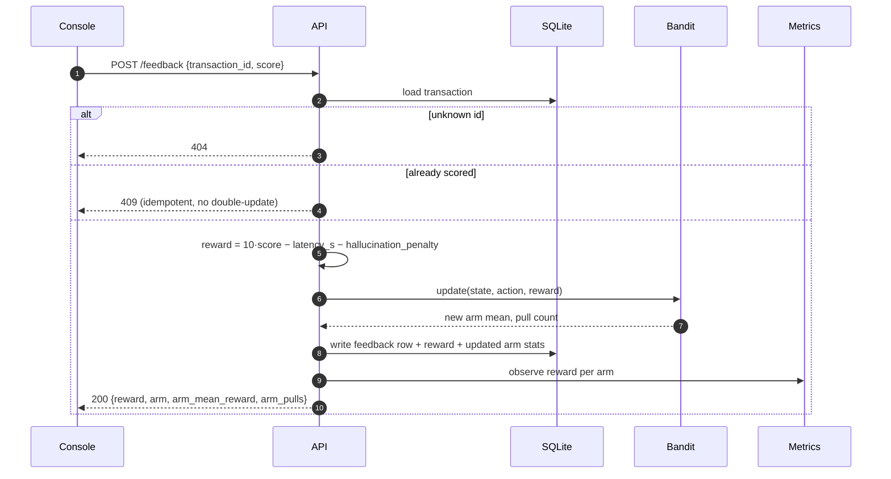

Returning the recomputed arm statistics is deliberate: the console can show the operator *the effect their click had*, which is the difference between a feedback button and a feedback loop.

---

## 7. Routing subsystem

### 7.1 Two-stage routing

Routing is split so that the parts we *know* are handed to rules, and only the genuinely uncertain part is handed to the learner.

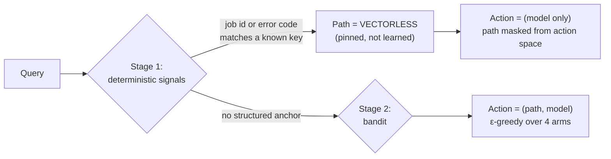

**Stage 1 (hard rules, deterministic).** A query containing a token that resolves to a primary key — a job ID that exists in `jobs`, or an error code that exists in `error_codes` — is answered from the structured store. This is not a heuristic guess; it is an exact match against real data, and it *cannot* be beaten by cosine similarity.

**Stage 2 (learned).** For everything else the path is genuinely uncertain, so it becomes part of the bandit's action space alongside the model choice.

### 7.2 Decision table

| Signal | Path | Rationale |
|---|---|---|
| Query contains an existing job ID | Vectorless (pinned) | Exact record retrieval; embeddings could surface a *different* job's chunk |
| Query contains a known error code | Vectorless (pinned) | Glossary is a dictionary; a hit is definitionally correct |
| Short keyword/entity lookup ("queue depth limit") | Vectorless (bandit-preferred) | BM25 over structured records is fast and precise |
| Open-ended "why/how/should I" with no structured anchor | Vector (bandit-preferred) | Answer is distributed across runbook prose |
| Both signals present ("why did job #482 hit RENDER_TIMEOUT and how do I retry it") | Vectorless first, vector as supplement | Fact anchors the answer; prose explains the remedy |
| Vector store unavailable | Vectorless (forced) | Degradation ([§18](#18-failure-modes--graceful-degradation)) |

### 7.3 The two canonical examples

**Vectorless clearly wins — `"what does error code RENDER_TIMEOUT mean"`.**
Vectorless returns `error_codes['RENDER_TIMEOUT']` — the exact definition, remediation, and severity, in ~2 ms, with a citation that is a primary key. The vector path embeds the query and returns the three *most similar* chunks, which for a corpus containing `RENDER_TIMEOUT`, `RENDER_STALLED`, and `UPLOAD_TIMEOUT` will likely mix definitions of neighbouring codes — a near-miss that reads plausible and is wrong. Precision, latency, and citation quality all favour the lookup.

**Vector clearly wins — `"why is my render slower than usual"`.**
There is no key to look up. The answer lives across three runbook passages (worker concurrency saturation, cold model cache, storage-delivery backpressure) that share almost no literal vocabulary with the query — "slower than usual" appears nowhere in the corpus. BM25 scores near zero; cosine similarity surfaces all three. The vectorless path would correctly return nothing and abstain, which is safe but unhelpful.

---

## 8. Retrieval subsystem

### 8.1 Corpus

| Artifact | Form | Feeds |
|---|---|---|
| `runbook-job-lifecycle.md` | prose | vector |
| `runbook-timeouts-and-retries.md` | prose | vector |
| `runbook-performance-degradation.md` | prose | vector |
| `architecture-faq.md` | prose | vector |
| `error-codes.json` | `{code → {meaning, severity, remediation}}` | vectorless (dictionary) |
| `jobs.json` → `jobs` table | structured rows (`id, status, failure_reason, worker, queued_at, duration_s`) | vectorless (PK + BM25) |

### 8.2 Vector path

- **Chunking:** heading-aware, ~500 characters with ~80-character overlap, so a chunk is a self-contained paragraph and citations point at something a human can read.
- **Embedding:** Ollama `nomic-embed-text`, computed once at boot for the corpus, per-request for the query.
- **Index:** in-process array of `{id, docId, heading, text, vector}`; brute-force cosine over ~50 vectors is microseconds — an ANN index would be pure ceremony here.
- **Retrieval:** top-k = 3, with a **similarity floor**. Below the floor the path returns *no evidence* rather than its best guess — this is the first line of hallucination defence, before any model runs.

### 8.3 Vectorless path

Two mechanisms behind one retriever:

1. **Exact lookup** — `jobs` by ID, `error_codes` by code. Returns `Evidence` whose `id` is the field path (`job:482.failure_reason`), giving a citation that is verifiable by construction.
2. **BM25 / TF·IDF** — over the concatenated text of structured records, for keyword queries with no exact key. Also floored: a low top score returns nothing.

Both are pure SQLite + in-process scoring: no network, no model, no embedding.

---

## 9. Agentic subsystem (ReAct)

### 9.1 Loop design

```
System prompt: you may only use the EVIDENCE block; cite every claim by evidence id;
               if evidence is insufficient, answer exactly "I don't know".
Loop (max 3 iterations):
  Thought:     do I have enough evidence?
  Action:      final_answer | check_job_status(job_id) | restart_render(job_id)
  Observation: tool result, appended to EVIDENCE as a new Evidence item
Terminate on: final_answer | step budget exhausted | LLM adapter failure
```

**Bounded by construction.** A hard step cap, a per-call timeout, and a whitelisted tool schema mean the loop cannot run away, cannot call an unknown tool, and cannot exceed its latency budget. Budget exhaustion is not an error — it produces an honest abstention that carries the hallucination penalty into the reward.

### 9.2 Tools

| Tool | Signature | Behaviour | Safety |
|---|---|---|---|
| `check_job_status` | `(job_id: string)` | Reads the `jobs` row; returns status, failure reason, worker, duration | Read-only |
| `restart_render` | `(job_id: string)` | **Mock** — records an intent, returns a simulated acknowledgement, mutates nothing real | Non-destructive by design; logged as `tool.mutation_simulated` |

Tool results enter the evidence set, so a tool-derived claim is cited and grounded exactly like a retrieved one — the verification plane never needs to know where evidence came from.

### 9.3 Model arms

| Arm | Model | Character |
|---|---|---|
| `llama3.2:3b` | Meta | Terser, faster; usually stronger on short factual synthesis |
| `qwen2.5:3b` | Alibaba | More verbose reasoning; often better on multi-step diagnostics |

Two genuinely distinct families rather than two sizes of one — so the bandit has a real distinction to learn, and so a single upstream regression cannot degrade both arms.

---

## 10. Reinforcement-learning subsystem

### 10.1 Formulation

| Element | Definition |
|---|---|
| **State** | Triage class from the classifier: `simple_lookup` \| `complex_diagnostic` \| `urgent_incident` (3 states) |
| **Action** | `(retrieval_path, model)` ∈ `{vector, vectorless} × {llama3.2, qwen2.5}` → 4 arms; when a hard rule pins the path, the action space is **masked** to the 2 arms sharing that path |
| **Policy** | ε-greedy, ε = 0.2 decaying to 0.05 as `pulls(state)` grows — explore early, exploit once estimates stabilise |
| **Reward** | `R = 10·feedback − latency_seconds − hallucination_penalty` |
| **Update** | Incremental sample mean: `Q(s,a) ← Q(s,a) + (1/N(s,a))·(R − Q(s,a))` |

### 10.2 Reward design notes

- **Scale:** the `10×` weight makes a helpful answer worth ~10 units against a latency cost of ~1–3 units, so the policy optimises helpfulness *first* and uses latency as the tie-breaker between paths of equal quality — exactly the intended trade-off.
- **Hallucination penalty:** `5.0` when the grounding gate forces an abstention or invalidates a citation, `0` otherwise. Because it is applied at answer time, an ungrounded answer is punished even if the operator never clicks anything, which prevents the policy from learning to gamble on unrated queries.
- **Sign:** rewards are legitimately negative (an unhelpful, slow, ungrounded answer scores ≈ −8). Sample-mean updates handle negatives correctly; nothing clamps at zero.

### 10.3 Update timing & the delayed-feedback problem

Feedback is asynchronous — the operator may click minutes later, or never. The design handles this with a **two-phase update**:

| Phase | Trigger | What updates |
|---|---|---|
| **Provisional** | End of `/query` | Latency + hallucination terms recorded on the transaction; arm pull count incremented so exploration accounting is honest |
| **Terminal** | `POST /feedback` | Full reward computed and folded into `Q(s,a)`; feedback marked so a second click is a no-op (409) |

Transactions that never receive feedback contribute their pull count but not a reward estimate — deliberately, so silence is not read as either approval or disapproval.

### 10.4 Persistence & cold start

Arm statistics live in a `bandit_arms` table (`state, action, pulls, mean_reward, last_updated`) written through on every update, so learning survives restarts — important for a demo where "it improved over the session" must be observable. Cold start uses **optimistic initialisation** (`Q₀ = 5.0`), which guarantees every arm is tried before any is abandoned, without needing a separate warm-up mode.

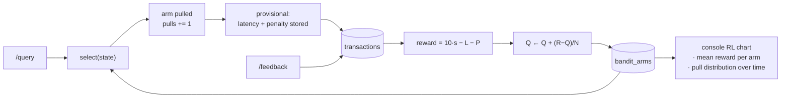

---

## 11. Groundedness & hallucination control

Defence in depth — four independent gates, three of which run *before* the model can speak.

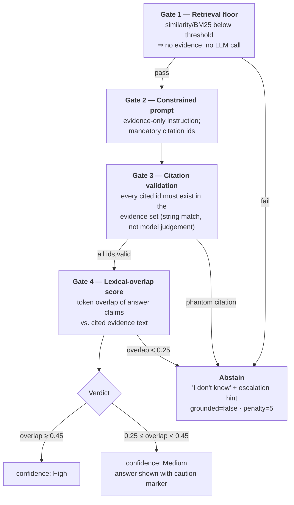

**Why lexical overlap rather than an LLM self-check as the primary gate.** A self-check asks the same class of system that produced the error to detect the error, costs a second generation, and is itself unfalsifiable. Lexical overlap is cheap, deterministic, unit-testable, and fails in the safe direction (it flags heavy paraphrase as low-confidence rather than passing invention as fact). An LLM self-check is a reasonable *secondary* gate for Medium-band answers if time allows — it is not the foundation.

**Citation validation is the strongest gate** because it is not a similarity judgement at all: a citation either names a real evidence ID or it does not. Fabricated sources — the most damaging failure in an ops context — are caught with certainty.

**Abstention is a first-class outcome.** `I don't know` returns HTTP 200 with `grounded: false` and an escalation hint. It is a correct answer, rendered distinctly in the console, and it still costs the arm a penalty — so the policy learns to prefer paths that produce *verifiable* answers, not merely confident ones.

---

## 12. Triage classifier subsystem

### 12.1 Design

| Aspect | Choice |
|---|---|
| **Task** | 3-class: `simple_lookup` / `complex_diagnostic` / `urgent_incident` |
| **Model** | Multinomial logistic regression (scikit-learn) — coefficients are directly interpretable, which Requirement 7 depends on |
| **Features** | query length (tokens); has-job-id flag; has-error-code flag; question-word flags (why/how/what); urgency lexicon hits ("production down", "P1", "stuck", "all jobs"); count of past incidents matching the query's dominant keyword |
| **Data** | ~300 synthetic labelled queries generated from templates × entity slots, committed to the repo for reproducibility |
| **Metrics** | Accuracy, per-class precision/recall/F1, confusion matrix → `ml/metrics_report.md`, generated by the training script |

### 12.2 Train/serve split

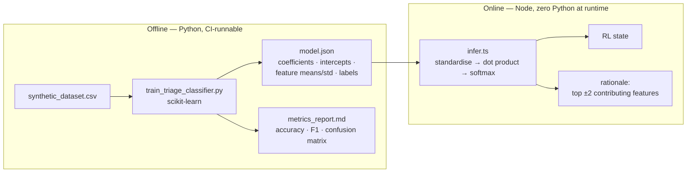

Real scikit-learn does the training and the metrics; Node does a 20-line dot product at request time. No Python process to keep alive, no cross-language RPC, no serving skew — the exported weights *are* the contract.

### 12.3 Expected behaviour & honest interpretation

On templated synthetic data, accuracy will be high (~0.90+) and that number should be reported with the caveat it deserves: the classifier is learning the generator's vocabulary, not real operator language. The confusion matrix is the informative part — the expected error mode is `complex_diagnostic` ↔ `urgent_incident`, since urgency and complexity genuinely co-occur in incident language. That confusion is **low-cost by design**: both classes route to the same bandit exploration behaviour, differing only in the console's urgency badge. `simple_lookup` — the class that changes routing most — is separated by the structured-anchor flags, which are near-deterministic signals.

---

## 13. Explainability subsystem

### 13.1 The rationale contract

Every `/query` response carries a `rationale` object built from decisions already recorded — no post-hoc reconstruction, no second model call:

```jsonc
{
  "path": {
    "chosen": "vectorless",
    "why": "Exact match on error code RENDER_TIMEOUT in the glossary — no embedding needed.",
    "deterministic": true
  },
  "model": {
    "chosen": "qwen2.5:3b",
    "why": "Exploit: highest mean reward for complex_diagnostic queries (7.4 over 12 pulls).",
    "exploring": false,
    "arm_mean_reward": 7.4,
    "arm_pulls": 12
  },
  "confidence": {
    "band": "High",
    "why": "All 2 citations resolve to retrieved evidence; 0.62 lexical overlap with cited text."
  },
  "triage": {
    "class": "complex_diagnostic",
    "why": "Flagged by: contains 'why did' (+1.8), query length 14 tokens (+0.9)."
  },
  "evidence": [
    { "id": "error_codes:RENDER_TIMEOUT", "excerpt": "Raised when a worker exceeds…" }
  ]
}
```

### 13.2 What is explained vs. left internal

| Explained to the operator | Left internal | Why |
|---|---|---|
| Which retrieval path, and the concrete trigger | Cosine values per chunk, BM25 term weights | The trigger is actionable ("it matched an error code"); raw scores are noise to a support engineer |
| Which model, exploit vs. explore, that arm's running reward | ε value, decay schedule, full Q-table | An operator needs to know *why this answer may be a deliberate experiment*; the tuning is ours |
| Confidence band + the specific reason for it | Overlap threshold constants | Bands are decidable ("Medium — verify before acting"); thresholds are implementation detail |
| Top 1–2 classifier features with signed contribution | Full coefficient matrix, standardisation params | Two features are checkable by a human; twelve are a data dump |
| Every citation, as a readable excerpt | Chunker settings, embedding model version | Citations are the whole point — they let a human verify the claim independently |

**The principle:** explain every decision that would change what the operator *does* with the answer; keep everything that would only change what an engineer does with the *system*. The bar is "an operator can sanity-check the decision path," not solved interpretability.

### 13.3 Delivery path

The rationale is a first-class field of the API response, persisted with the transaction and rendered in the console's expandable panel — not a log line. An explanation that only reaches the logs fails Requirement 7 by definition.

---

## 14. Data model & storage

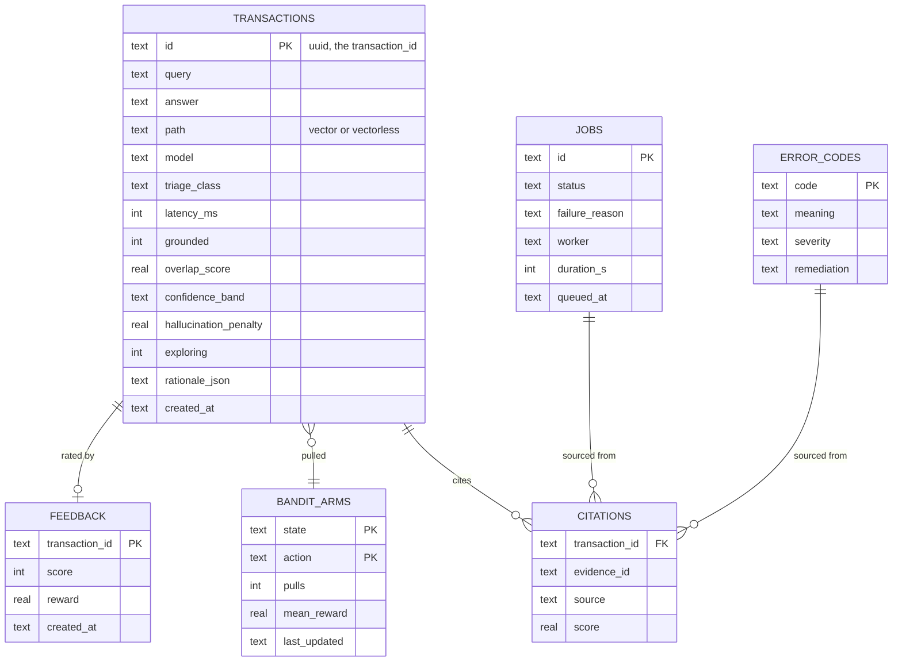

| Store | Contents | Durability | Rebuildable? |
|---|---|---|---|
| SQLite (`better-sqlite3`) | jobs, error codes, transactions, feedback, citations, bandit arms | On disk, WAL mode | Reference data yes (from seed); learned state no — this is the system's memory |
| In-memory vector index | chunk text + embeddings | Ephemeral | Yes — rebuilt from the corpus at boot in a few seconds |
| Log stream | JSON events on stdout | Whatever the platform captures | N/A |

**Retention:** transactions and feedback are unbounded in this build (a demo generates hundreds of rows). At real volume, transactions would age out to cold storage after 30 days while `bandit_arms` — a few dozen rows regardless of traffic — persists indefinitely.

---

## 15. Interface contracts

### `POST /query`

```jsonc
// request
{ "query": "why did job #482 fail" }

// 200 response
{
  "transaction_id": "b1f0…",
  "answer": "Job 482 failed with RENDER_TIMEOUT after 1802s on worker-07…",
  "retrieval_path": "vectorless",
  "llm_used": "llama3.2:3b",
  "latency_ms": 940,
  "grounded": true,
  "hallucination_risk": "low",          // low | medium | high
  "citations": [
    { "id": "job:482.failure_reason", "source": "vectorless", "excerpt": "RENDER_TIMEOUT" }
  ],
  "rationale": { /* see §13.1 */ },
  "degraded": false                     // true when a fallback was used
}
```

| Status | Meaning |
|---|---|
| 200 | Answered — *including* a grounded abstention (`grounded: false`) |
| 400 | Invalid body (zod) — empty query, wrong types |
| 503 | All retrieval paths and both models unavailable — nothing honest can be returned |

### `POST /feedback`

```jsonc
// request
{ "transaction_id": "b1f0…", "score": 1 }

// 200 response
{ "reward": 8.06, "arm": "vectorless|llama3.2:3b", "arm_mean_reward": 7.4, "arm_pulls": 13 }
```

| Status | Meaning |
|---|---|
| 200 | Reward computed and folded into the policy |
| 404 | Unknown transaction |
| 409 | Already rated — idempotent, policy untouched |

### Supporting routes

| Route | Purpose |
|---|---|
| `GET /transactions?limit=n` | Console feed: recent transactions with path, model, latency, grounding, rationale, feedback state |
| `GET /rl/stats` | Per-arm pulls, mean reward, and a reward time series for the console chart |
| `GET /health` | Real dependency probes ([§17](#17-observability-architecture)) |
| `GET /metrics` | Prometheus text exposition |

---

## 16. Frontend architecture

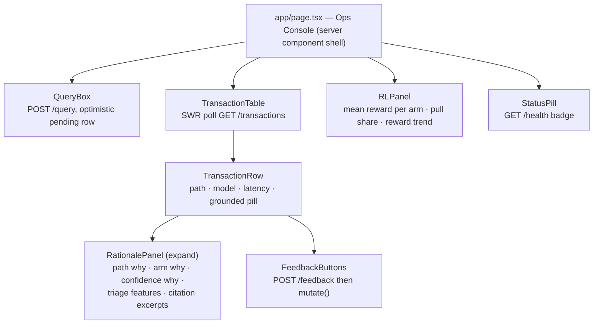

**Design rules.** The console holds no business logic — it renders what the API decided. Feedback uses optimistic update plus SWR `mutate()`, so a click visibly changes both the row and the RL panel; a failed POST rolls back rather than lying. Ungrounded answers render with a distinct amber treatment so abstentions read as *deliberate honesty*, not as errors. When `/health` reports degraded, the status pill names the dependency that is down — the same information the 3am on-call needs.

---

## 17. Observability architecture

### 17.1 Structured logging

One JSON line per event, `transaction_id` bound to a child logger at request entry so every downstream layer inherits it. Grepping one ID reconstructs the entire decision path:

```jsonc
{"ts":"…","level":"info","transaction_id":"b1f0…","event":"triage.classified","class":"simple_lookup","confidence":0.91,"top_features":["has_error_code","query_len"]}
{"ts":"…","level":"info","transaction_id":"b1f0…","event":"router.decided","path":"vectorless","reason":"error_code_exact_match","deterministic":true}
{"ts":"…","level":"info","transaction_id":"b1f0…","event":"bandit.selected","state":"simple_lookup","action":"vectorless|llama3.2","exploring":false,"arm_mean":7.4}
{"ts":"…","level":"info","transaction_id":"b1f0…","event":"retrieval.completed","path":"vectorless","hits":1,"top_score":1.0,"ms":3}
{"ts":"…","level":"info","transaction_id":"b1f0…","event":"agent.step","step":1,"action":"final_answer"}
{"ts":"…","level":"warn","transaction_id":"b1f0…","event":"grounding.failed","overlap":0.18,"invalid_citations":1,"decision":"abstain"}
{"ts":"…","level":"info","transaction_id":"b1f0…","event":"rl.updated","reward":-2.1,"arm":"vector|qwen2.5","new_mean":3.9,"pulls":9}
```

Event names are a closed vocabulary (`triage.*`, `router.*`, `bandit.*`, `retrieval.*`, `agent.*`, `grounding.*`, `rl.*`, `dep.*`) so dashboards and alerts can be built on stable keys rather than log-message regexes.

### 17.2 Metrics (`/metrics`, Prometheus text)

| Metric | Type | Labels | Answers |
|---|---|---|---|
| `copilot_requests_total` | counter | `route`, `status` | Traffic and error rate |
| `copilot_request_duration_seconds` | histogram | `route`, `path`, `model` | p50/p95 latency, per path and model |
| `copilot_retrieval_hits` | histogram | `path` | Is retrieval returning evidence or falling through the floor? |
| `copilot_grounding_failures_total` | counter | `reason` | Hallucination-gate trip rate — the key quality signal |
| `copilot_rl_reward` | gauge | `state`, `action` | Per-arm running reward (Requirement 11's explicit ask) |
| `copilot_rl_pulls_total` | counter | `state`, `action`, `exploring` | Exploration/exploitation balance |
| `copilot_dependency_up` | gauge | `dependency` | Vector store / Ollama reachability over time |

### 17.3 `/health` — real probes, not a hardcoded 200

| Check | Method | Failure → status |
|---|---|---|
| SQLite | `SELECT 1` | `down` (fatal — 503) |
| Vector index | index non-empty and queryable | `degraded` |
| Ollama generation | cached `GET /api/tags` (≤10 s TTL), verifying both model tags present | `degraded` |
| Embeddings | same probe, embedding model tag | `degraded` |

Response: `{ status: "ok" | "degraded" | "down", checks: { … }, uptime_s, version }`, with HTTP 200 for ok/degraded and 503 for down — so a load balancer sheds only genuinely dead instances while a degraded one keeps serving vectorless answers.

### 17.4 "If this broke at 3am"

An ordered runbook built on the telemetry above:

1. **`GET /health`** — which dependency flipped? Ollama down is the common case, and the expected symptom is every answer arriving on the vectorless path with `degraded: true`.
2. **`GET /metrics`** — is `copilot_grounding_failures_total` climbing? A spike with healthy dependencies means retrieval quality regressed (bad seed data, empty index after a restart), not an outage.
3. **Latency histogram by `path` label** — if only `path="vector"` degraded, suspect the embedding endpoint, not the whole runtime.
4. **Grep one bad `transaction_id`** — the seven log lines above replay the full decision path: classified as what, routed why, retrieved how many hits, which gate tripped.
5. **`copilot_rl_reward` by arm** — a single arm collapsing means one model regressed; all arms collapsing means the problem is upstream of the policy (retrieval or grounding).
6. **Mitigation** — force the vectorless path via config and restart the API; the vector index rebuilds from the corpus at boot, and bandit state survives in SQLite, so no learning is lost.

---

## 18. Failure modes & graceful degradation

Every dependency has a declared fallback. The system's stated contract is: **degrade to a narrower but still-grounded answer, or abstain — never crash, never guess.**

| Failure | Detection | Behaviour | Operator sees |
|---|---|---|---|
| Ollama unreachable | Connection error / timeout on adapter | Vectorless path returns the raw structured record as a templated answer with no generation | `degraded: true`, rationale explains "answering from structured record; model runtime unavailable" |
| One model tag missing | `/api/tags` probe | Bandit action space masked to the healthy model; arm marked unavailable, not penalised | Model shown as the surviving arm |
| Embedding model down | Probe / embed error | Vector path disabled; all queries forced vectorless | Amber health pill; open-ended queries may abstain |
| Vector index empty (boot race) | `index.size === 0` | Same as above; boot retries indexing with backoff | Health `degraded` until indexed |
| Retrieval below floor | Score threshold | Abstain with escalation hint; hallucination penalty applied | "I don't know" row, amber |
| LLM emits phantom citation | Citation validator | Answer replaced by abstention | Low-confidence explanation naming the invalid citation |
| Agent step budget exhausted | Loop counter | Abstain rather than force a final answer | "I don't know", rationale states the budget |
| SQLite unavailable | `SELECT 1` fails | 503 from `/health` and `/query` — nothing can be recorded or learned, so serving would be dishonest | Red pill, hard failure |
| Duplicate feedback | Unique key on `transaction_id` | 409, policy untouched | Button disabled after first click |
| Malformed request | zod parse | 400 with field-level errors | Inline validation |

**The load-bearing invariant:** degradation always moves *toward* determinism — vector → vectorless → structured template → abstention. Every step down that ladder is more verifiable than the one above it, so a degraded system is a *more* conservative one, never a less trustworthy one.

---

## 19. Deployment & CI/CD topology

### 19.1 Runtime topology

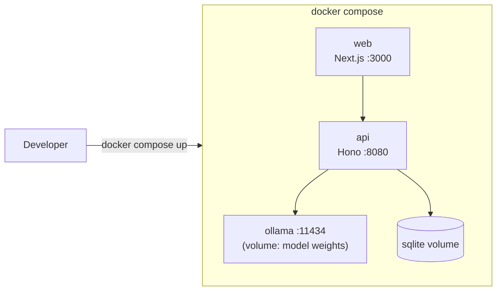

Two multi-stage Dockerfiles (deps → build → slim runtime, non-root user, healthcheck directive pointing at `/health`). Ollama is a compose service with a persistent volume so model pulls happen once. The API waits for SQLite and indexes the corpus on boot; it starts successfully even if Ollama is not yet warm, reporting `degraded` until it is — start-up order is not a correctness dependency.

### 19.2 Pipeline

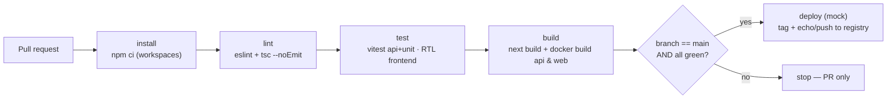

Lint and test failures fail the build; the deploy job declares `needs: [test, build]` and `if: github.ref == 'refs/heads/main'`, so it is unreachable from a PR and unreachable after a red test. Docker builds run in CI on every PR — a broken image is a broken build, caught before merge rather than at deploy. The classifier training script runs in CI too, so `model.json` and `metrics_report.md` can never drift from the committed dataset.

---

## 20. Test architecture

| Layer | Scope | Representative cases |
|---|---|---|
| **RL unit** (highest scrutiny) | Pure functions, no I/O | Reward arithmetic incl. negatives and a non-zero hallucination penalty; incremental-mean correctness over a known sequence; ε=0 always exploits; ε=1 always explores; optimistic init tries every arm before repeating; action masking when a path is pinned; state transitions across all three triage classes |
| **Retrieval** | One test per path | Vector: `"why is my render slower than usual"` returns the performance-degradation chunk in the top 3. Vectorless: `"RENDER_TIMEOUT"` returns exactly the glossary row; `"job 482"` returns that job's fields. Floor test: nonsense query returns *no* evidence |
| **Grounding** | Gate logic | Phantom citation → abstain; high overlap → High band; borderline overlap → Medium |
| **API** | Route contracts | `/query` shape and required fields; `/feedback` updates arm stats; 404 unknown id; 409 duplicate; 400 invalid body; **failure mode: Ollama mocked unreachable → 200 with `degraded: true` and no crash**; vector store mocked empty → forced vectorless |
| **Frontend** | Component | Feedback button posts and reflects state; rationale panel renders path/arm/confidence; ungrounded row renders its distinct treatment |
| **Contract** | Cross-cutting | The `rationale` object the API emits matches what the console destructures — the seam most likely to rot |

Fakes over mocks where it matters: a deterministic stub LLM adapter and a fixed-vector embedder make agent and retrieval tests fast and non-flaky, and let CI run with no Ollama present at all.

---

## 21. Security, privacy & safety

| Concern | Treatment |
|---|---|
| **Prompt injection via corpus** | Retrieved text is delimited as data in the prompt; the tool schema is a closed whitelist, so injected "call restart_render" text cannot invent a tool or an argument shape. Every tool call is logged with its arguments |
| **Destructive actions** | `restart_render` is a non-destructive mock. In a real deployment the design calls for an explicit human-confirmation step before any mutating tool — the agent proposes, the operator commits |
| **Model output as untrusted input** | Answers are rendered as text, never as HTML; citation IDs are validated against a known set before use |
| **Input validation** | zod at every route boundary; parameterised SQL only; job IDs and error codes matched against known keys, never interpolated |
| **Secrets** | None required — the local-model choice removes the whole API-key surface. Config is environment variables with safe defaults |
| **PII** | Queries are stored verbatim for the RL loop and could contain incident details; in production this needs a retention policy and access control on `/transactions`. Called out rather than silently ignored |
| **Auth** | Out of scope for a single-operator console; the natural insertion point is Hono middleware in front of all routes, with `/health` and `/metrics` on a separate internal listener |

---

## 22. Performance envelope & scaling path

### 22.1 Current envelope

| Dimension | This build | Bound by |
|---|---|---|
| Corpus | 5–6 docs, ~50 chunks | Brute-force cosine is trivial at this size |
| Throughput | ~1–5 concurrent queries | Local 3B model generation, not the API |
| p50 latency | ~1.0 s vectorless / ~1.3 s vector | LLM generation dominates by ~10× |
| RL convergence | Tens of feedback events per state to separate arms | Feedback volume, not compute |

### 22.2 What changes at 100×

| Pressure | First thing to break | Change |
|---|---|---|
| 10k+ chunks | Brute-force cosine | Swap the `Retriever` implementation for Chroma/FAISS/pgvector — the interface and the router are untouched |
| Multiple API replicas | In-memory bandit state diverges per replica | Move `bandit_arms` to Postgres/Redis with atomic increments; the two-phase update already tolerates async writes |
| High QPS | Ollama becomes the bottleneck | Queue + batch generation; or route the `simple_lookup` state to a template-only, model-free path the bandit can learn to prefer |
| Many query types | 3-state × 4-arm table is too coarse | Move from a tabular bandit to LinUCB over the feature vector — same reward, richer context, still no deep net |
| Real corpus churn | Boot-time indexing is too slow | Incremental indexing with content hashing, index persisted to disk |
| Feedback sparsity | Most transactions never rated | Add implicit signals (dwell, escalation, follow-up query) as partial rewards — the reward function is already a weighted sum, so this is an additive change |

---

## 23. Key design decisions (ADR log)

| # | Decision | Alternatives considered | Rationale |
|---|---|---|---|
| **AD-1** | Hybrid routing: deterministic rules first, bandit for the residual | Pure LLM router; pure bandit over all queries | An exact key match is *knowledge*, not a hypothesis — spending exploration budget on it would be strictly worse. The bandit gets the genuinely uncertain decisions, where learning pays |
| **AD-2** | Bandit action = (path, model), path-masked when pinned | Separate bandits per decision; independent choices | Path and model interact (a terse model suits exact lookups; a verbose one suits multi-chunk synthesis), so a joint action captures it. Masking keeps the deterministic guarantee intact |
| **AD-3** | Tabular ε-greedy over LinUCB/Thompson | LinUCB; Thompson sampling | 3 states × 4 arms converges in tens of samples, which is what a demo can actually produce. LinUCB is the documented upgrade path, not the starting point |
| **AD-4** | Lexical overlap + citation validation as the primary grounding gate | LLM self-check as primary; NLI model | Deterministic, unit-testable, no extra generation, fails safe. Citation validation catches fabricated sources with certainty — the highest-consequence failure in ops |
| **AD-5** | scikit-learn offline → JSON weights → Node inference | Python sidecar service; pure-JS training | Real scikit-learn metrics (as required) with a single-runtime deployment. Logistic regression's linearity is what makes the feature-level explanation honest |
| **AD-6** | In-process vector store | ChromaDB; FAISS | ~50 vectors. A vector DB adds a container and a failure mode for zero accuracy gain. The `Retriever` interface makes the swap a one-file change |
| **AD-7** | Local Ollama models, two distinct families | Hosted API tiers; two sizes of one model | No keys, no rate limits, reproducible anywhere — and two families give the bandit a real distinction while removing common-mode failure |
| **AD-8** | Abstention returns 200, not an error | 404/422 for "I don't know" | "I don't know" is a *correct answer* and must flow through the same rating and reward path as any other, so the policy can learn from it |
| **AD-9** | SQLite for durable state | In-memory only; Postgres | Learned state must survive restarts for "it improved over the session" to be demonstrable; Postgres is a container's worth of ceremony at this scale |
| **AD-10** | Provisional + terminal two-phase RL update | Update only on feedback; simulate missing feedback | Latency and hallucination signals exist at answer time; waiting for a click that may never come would discard them, and unrated silence must not be read as approval |

---

## 24. Out of scope & future work

**Deliberately excluded from this build:** authentication and multi-tenancy; real render-platform integration; distributed vector serving; deep-RL policies; calibrated confidence probabilities; full LLM interpretability; conversation memory across turns; automated corpus refresh.

**Natural next increments, in order of value:**

1. **Implicit feedback signals** — dwell time and escalation-after-answer as partial rewards, fixing the sparsity that limits the current loop most.
2. **Offline policy evaluation** — replay logged transactions against a candidate policy before shipping it, so routing changes stop being a production experiment.
3. **NLI-based entailment as a second grounding gate** for Medium-band answers, converting some cautious abstentions into confident answers.
4. **Human-in-the-loop for mutating tools** — the confirmation step that would make `restart_render` safe against a real control plane.
5. **Corpus quality telemetry** — track which chunks are cited and which are never retrieved, turning the grounding gate into a signal about the *documentation*, not just the agent.
